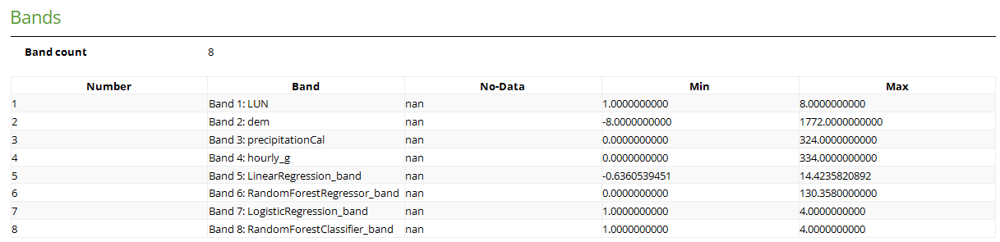
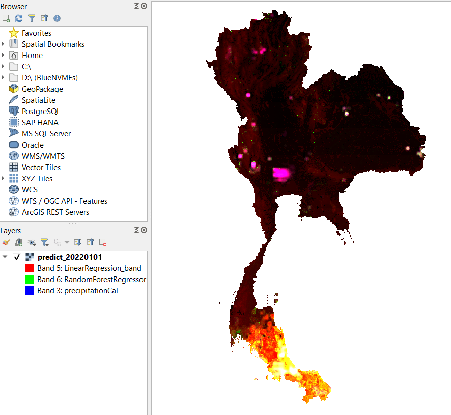

# Rain Project

## To do

## Table of Content

- [Rain Project](#rain-project)
  - [To do](#to-do)
  - [Table of Content](#table-of-content)
  - [This project](#this-project)
  - [Objective](#objective)
  - [Intuitive](#intuitive)
    - [Classification](#classification)
  - [Installation](#installation)
  - [Methodology](#methodology)
    - [0. Get Your Account](#0-get-your-account)
      - [0-1. Account for IMERG](#0-1-account-for-imerg)
      - [0-2. Account for GSMaP](#0-2-account-for-gsmap)
    - [1. Download scripts](#1-download-scripts)
      - [1-1. download\_imerg.py](#1-1-download_imergpy)
      - [1-2. download\_gsmap\_dat.py](#1-2-download_gsmap_datpy)
    - [2. Preprocess scripts](#2-preprocess-scripts)
    - [3. Inference Script](#3-inference-script)
  - [Performance](#performance)
  - [Utility](#utility)
    - [Check download](#check-download)

## This project

This project is an implementation after [Multi-Source Precipitation Data Merging for Heavy Rainfall Events Based on Cokriging and Machine Learning Methods](https://doi.org/10.3390/rs14071750).

## Objective

To predict the amount of rainfall in one day.

## Intuitive

There is a high correlation between actual `rainfall` ($y$) and `Satellite`, `Landuse`, `Digital elevation model (DEM)`, `Season`, and `GPS (Lat, Lon)` ($X$).
The model is trained using `rainfall` information from the Thailand weather stations.
Then we can generate the precipitation prediction using `Satellite`, `Landuse`, `Digital elevation model (DEM)`, and `GPS (Lat, Lon)`.

$$ X = [Satellite, Landuse, DEM, Season, GPS] $$
$$ y = rainfall $$
$$ model(X) = \hat{y} $$
$$ model(Satellite, Landuse, DEM, Season, GPS) = \hat{rainfall} $$

### Classification

The above equation is for framing a regression relation. In this project, we include the new prediction based on classification.

In general, the prediction equation looks the same. The difference is the label/target ($y$). Instead of predicting the amount of `rainfall`, we predict the **level/class/group** of `rainfall`. The level of rainfall is decided using the following logic.

```txt
level 1: ไม่ตก < 0.1
level 2: ฝนเล็กน้อย (Light rain) มีปริมาณฝนตั้งแต่ 0.1 มิลลิเมตร 10.0 มิลลิเมตร 
level 3: ฝนปานกลาง (Moderate rain) มีปริมาณฝนตั้งแต่ 10.1 มิลลิเมตร 35.0 มิลลิเมตร 
level 4: ฝนหนัก (Heavy rain) มีปริมาณฝนตั้งแต่ 35.1 มิลลิเมตร 90.0 มิลลิเมตร 
level 5: ฝนหนักมาก (Very heavy rain) มีปริมาณฝนตั้งแต่ 90.1 มิลลิเมตรขึ้นไป
```

We also calculate a **level/class/group** of features ($x$) `Satellite`, `Digital elevation model (DEM)`, and `GPS (Lat, Lon)`.

- `Satellite`: use the same grouping logic as `rainfall`
- `GPS (Lat, Lon)`: map to the `region`
- `Digital elevation model (DEM)`:

```txt
level 1: below_0
level 2: 0-100
level 3: 101-300
level 4: 300-600
level 5: 600_more
```

## Installation

This project is developed under a `Docker` environment. We tested the usability with `Ubuntu 22.04` Operating System. Therefore, we recommend you use this project via `Docker`.

In short, we provided the shell script for you to set this project up. After you cloned this project, you can run the following command to install `Docker` and set up `rootless`. Keep in mind that the user must have `sudo` permission to install `Docker`. After the `rootless` installation, the `sudo` permission is not needed.

To install `Docker` and set up `rootless`.

```shell
$ setup-docker.sh
## To build the image
$ build-docker.sh
```

Then

```shell
## To run the project
$ run-docker.sh
====Rain Project==== 
version:2.0.0

Welcome to the project. 
Select which task you want to run.
Or, You can provide [task] when calling this script.

Example: docker compose run --rm rain bash main.sh [task]

Task list
=========
- Clean
    This will clean 'temp' and 'log'
    [0]: clean
- Download
    [1]: download imerg
    [2]: download gsmap
- Preprocess
    [3]: preprocess imerg
    [4]: preprocess gsmap
- Label
    [5]: prepare label
    [6]: merge label
- Model
    [7]: train model
    [8]: predict
- Utility
    [9]: check download file

ctrl + D to exit

Select Task: 0
```

> Docker works similar to a VM. You need an image and then you can build instances base from the image. In a normal situation, you would find an image from the `Docker hub` just like when you download `Ubuntu 22.04` ISO from the Ubuntu website. Then we build a container (Docker term for an instance) and use it.
>
> In this project, we customized the image which inspectable via `deploy.Dockerfile`. This image is custommized such that after the build, the image is ready for running project.
>
> We manage the project using `docker compose` which encapsulates `docker run` command. Without compose, we have to specify multiple options in the `docker run` command which is tedious. The `docker compose` use the parameters in `docker-compose.yaml` file. This means we do not need to remember or make another seperate file for creating the container. This is only one adventage out of many why `docker compose` is preffered why to interact with `Docker` containers.
>
> Installation for Docker users is pretty straightforward, `.Dockerfile` and `docker-compose.yaml` are already provided in this repository. Thus, you only need to `compose up` to build and run the Docker.
>
> We provided even more encapsulated shell script that hide all of this for the new `Docker` users. `setup-docker.sh` is for installing `Docker` and activate `rootless` environment, `build-docker.sh` is for building the image from `deploy.Dockerfile`, and `run-docker.sh` is for executing the project.

## Methodology

Predicting the `rainfall` ($\hat{y}$) requires `Satellite`, `Landuse`, `DEM`, `Season`, and `GPS` ($X$) and the model. The `Satellite` data can be obtained and preprocessed using our project which we will discuss later. Both `Landuse` and `DEM` have to be provided manually. The `GPS` is referenced from the `Landuse` Lat Long coordinate and `Season` is calculated from the date we want to predict. And, models are trained separately (please refer to the `README_addition.md`). In this document, we will only discuss the prediction part.

What do you need to do if you want to predict `rainfall` of 3rd April 2023 (3/4/2023)?

> **Time Zone**
>
> The time zone used by `IMERG` and `GSMaP` is UMT+0. If we want to create a 1-day satellite data for Thailand which is UTM+7, we will need to have files from 07:00 day1 till 06:00 day2. Thus, when you set the range of date to download, always consider one day extra to accomodate this fact.

0. Create an account for downloading the `Satellite` data
   - [0. Get Your Account](#0-get-your-account)
     - [0-1. Account for IMERG](#0-1-account-for-imerg)
     - [0-2. Account for GSMaP](#0-2-account-for-gsmap)
1. Download the `Satellite` data of 3rd April 2023
   - [1. Download scripts](#1-download-scripts)
     - [1-1. download\_imerg.py](#1-1-download_imergpy)
     - [1-2. download\_gsmap\_dat.py](#1-2-download_gsmap_datpy)
2. Preprocess the `Satellite` data
   - [2. Preprocess scripts](#2-preprocess-scripts)
3. Perform Inference
   - [3. Inference Script](#3-inference-script)

The output of the prediction/inference is GeoTiff five bands data including `IMERG`, `GSMAP`, `LANDUSE`, `DEM`, and all predicted `rainfall` ($\hat{y}$) where the area is following the Lat Lon Coordinate of `Landuse` file. Further detail will be discussed in the inference section.

Now that you have a brief idea, we will go into detail next.

### 0. Get Your Account

To download the `Satellite` data (both `IMERG` and `GSMAP`), you need to have a credential for accessing the downloading server. The credential should be in `.secret.yaml` under `./projects`. You won't find the file there because the file is ignored in the repository (for security reasons of cause). Therefore, you have to create the file by yourself.

1. Create a `.secret.yaml` under `./projects` (`./projects/.secret.yaml`)
2. Copy the template below.

```yaml
imerg:
    ## account for the `disc.gsfc.nasa.gov`
    username: 
    password: 
gsmap:
    ## account for the `hokusai.eorc.jaxa.jp`
    username: 
    password:
```

#### 0-1. Account for IMERG

**Quick-Step** \
If you do not want to read the full instruction, you can follow this quick step to get the account.

1. Create an account [here](https://disc.gsfc.nasa.gov/information/documents?title=Data%20Access).
2. Authorize the 'NASA GESDISC DATA ARCHIVE' app [here](https://urs.earthdata.nasa.gov/approve_app?client_id=e2WVk8Pw6weeLUKZYOxvTQ)
3. Set username and password in `.secret.yaml`

> [Official Instruction](https://gpm1.gesdisc.eosdis.nasa.gov/data/GPM_L3/GPM_3IMERGHHE.06/)
>
> Access to GES DISC data requires all users to be registered with the Earthdata Login system. Data continue to be free of charge and accessible via HTTPS. Access to data via anonymous FTP is no longer available. Detailed instructions on how to register and receive authorization to access GES DISC data are provided [here](https://disc.gsfc.nasa.gov/data-access).
>
> GES DISC Users who deploy scripting methods to list and download data in bulk via anonymous FTP are advised to review the [How to Download Data Files from HTTPS Service with wget](https://disc.gsfc.nasa.gov/information/howto?title=How%20to%20Download%20Data%20Files%20from%20HTTPS%20Service%20with%20wget) recipe that provides examples of GNU wget commands for listing and downloading data via HTTPS.
>
> Once registered, you can [click here](https://urs.earthdata.nasa.gov/approve_app?client_id=e2WVk8Pw6weeLUKZYOxvTQ) to authorize 'NASA GESDISC DATA ARCHIVE' application.

#### 0-2. Account for GSMaP

1. register for an account via this [link](https://sharaku.eorc.jaxa.jp/GSMaP/registration.html)
2. wait for the confirmation email. Then, confirm your registration.
3. wait for the FTP credential that will send to your email.
4. Set the username and password in `.secret.yaml`

### 1. Download scripts

There are two satellite data to download `IMERG` and `GSMAP`.
The project provides scripts for downloading each set of data separately.

In general, the parameters `start_date` and `stop_date` (inclusive) are used to specify the range of dates we want to download.
Thus, if we want to predict the amount of rainfall for 3rd April 2023, we will config the `start_date` and `stop_date` as `03-04-2023` and `04-04-2023` respectively. This is because the timezone reference of `Satellite` data is UTM+0 but the Thailand timezone is +7.

<!-- For instance, if the file we want to download in the server is `<server_url>/year/month/date/a.file` then the file that is downloaded will be kept in `<destination>/year/month/date/a.file`. -->

#### 1-1. download_imerg.py

Running this script will download the `IMERG` data.
It will use the credential set in `.secret.yaml`:`imerg`.
Below is an example of parameters in the `download_imerg_config.yaml`.

```yaml
imerg:
  ## date format is dd-mm-yyyy
  start_date: 03-04-2023 
  stop_date: 04-04-2023
  imerg_url: https://gpm1.gesdisc.eosdis.nasa.gov/data/GPM_L3/GPM_3IMERGHHL.06
  destination: /root/projects/data/IMERG
  retry_max: 3
  retry_wait: 10 ## second(s)
  timeout: 100 ## second(s)
  ignore_cache: False # When True the script will always check file list from servers and rewrite the cache in /temp
  log_level: 10
  log_wget_level: 10
```

> **Retry logic**
>
> Retry here is for the downloading function/library. When a file is downloading, there is a chance the download could fail from a short interrupt internet connection. Thus, when the failure occur during downloading, the script will retry again. The logic for the retry is as followed.
>
> ```python
> retry_attempt = 1
> while True:
>   download_file(TIMEOUT) ## Download will fail if it could not finish in this TIMEOUT threshold
>   if fail and retry_attemp < RETRY_MAX:
>      retry_attemp += 1
>      sleep(RETRY_WAIT)
>      continue ## back to download
>   raise TimeoutError(f"The download fails to complete after {RETRY_MAX}.")
> ```
>
> **Ignore Cache**
> 
> The download scripts has a process to check the list of file from server before it attempts to download each file iterativly.
> Becuase the list of file should not change, the script cache list for debuging and save time when the user want to rerun the operation.
> However, the users can choose to change this behavior by enable `ignore_cache` option in the configuration file.
> Thus, the script will always check the list of file from the server and rewrite the cache.
> 
> **LOG level**
>
> Each script has its own logger. Logs files are kept inside `projects/log` folder. The naming scheme is `[scipt_name].log`. Only the download script has two logs. The second logger is dedicated to log the downloading library. We sperate the logger because there will be a lot of logs written in the second logger.
>
> The meaning of the level number is the following
>
> - CRITICAL = 50
> - ERROR = 40
> - WARNING = 30
> - INFO = 20
> - DEBUG = 10
> - NOTSET = 0
>
> The log level will allow the logger to log any level higher than the one that is set. For example, if we set the log level to `10` (DEBUG), the type of log that will be logged are CRITICAL, ERROR, WARNING, INFO, and DEBUG.
>
> Log is routed to two destinations, one is to the file and another one is to the standard out (terminal screen). Thus, when you run the script, you will also see the log in real time.

`IMERG` folder is structured as `<server_url>/year/date_of_year/30-min.file` which the downloading script will follow.
Thus, if we download the files using the example configuration, we should have these files.

```txt
projects/
|-- data/
|   |-- IMERG/
|       |-- 2023/
|           |-- 093/
|               |    <IMERG_PREFIX_NAME>.20230403-S000000-<POSTFIX>.HDF5
|               |    <IMERG_PREFIX_NAME>.20230403-S003000-<POSTFIX>.HDF5
|               |    <IMERG_PREFIX_NAME>.20230403-S013000-<POSTFIX>.HDF5
|               |    ...
|               |    <IMERG_PREFIX_NAME>.20230403-S230000-<POSTFIX>.HDF5
|               |    <IMERG_PREFIX_NAME>.20230403-S233000-<POSTFIX>.HDF5
```

For each day, there will be 48 files.

`IMERG` has three different versions (Early, Late, and Final).
To choose which version to download, you have to specify the appropriate `imerg_url` in the `config.py`.

- For the early version `https://gpm1.gesdisc.eosdis.nasa.gov/data/GPM_L3/GPM_3IMERGHHE.06`
- For the late (default) version `https://gpm1.gesdisc.eosdis.nasa.gov/data/GPM_L3/GPM_3IMERGHHL.06`

The data format is HDF5 and the shape is as followed.

```txt
lon: (3600,)
lat: (1800,)
precipitationCal: (1, 3600, 1800)
precipitationUncal: (1, 3600, 1800)
```

#### 1-2. download_gsmap_dat.py

Running this script will download the `GSMAP` data.
It will use the credential set in `.secret.yaml`:`gsmap`.
Below is an example of parameters in the `download_gsmap_config.yaml`.

```yaml
gsmap:
  ## date format is dd-mm-yyyy
  start_date: 03-04-2023 
  stop_date: 04-04-2023
  gsmap_host: hokusai.eorc.jaxa.jp
  hourly:
    gsmap_file_path: /standard/v7/hourly/
    file_prefix: gsmap_mvk
    destination: /root/projects/data/GSMAP_hourly
  hourly_g:
    gsmap_file_path: /standard/v7/hourly_G/
    file_prefix: gsmap_gauge
    destination: /root/projects/data/GSMAP_hourly_G
  retry_max: 3
  retry_wait: 10 ## second(s)
  timeout: 100 ## second(s)
  ignore_cache: False # When True the script will always check file list from servers and rewrite the cache in /temp
  log_level: 10
  log_ftp_level: 10
```

`GSMAP` is a bit tricky.
Since we are downloading the DAT format, we have to download both `hourly` and `hourly_GagueCalibrate` separately.
When the data is downloaded, the folder structure is as below (following the server folder structure).

```txt
projects/
|-- data/
|   |-- GSMAP_hourly/
|       |-- 2023/
|           |-- 04/
|               |-- 03/
|                   |    gsmap_mvk.20230403.0000.v7.<POSTFIX>.dat.gz
|                   |    gsmap_mvk.20230403.0100.v7.<POSTFIX>.dat.gz
|                   |    gsmap_mvk.20230403.0200.v7.<POSTFIX>.dat.gz
|                   |    ...
|                   |    gsmap_mvk.20230403.2200.v7.<POSTFIX>.dat.gz
|                   |    gsmap_mvk.20230403.2300.v7.<POSTFIX>.dat.gz
|   |-- GSMAP_hourly_G/
|       |-- 2023/
|           |-- 04/
|               |-- 03/
|                   |    gsmap_gauge.20230403.0000.v7.<POSTFIX>.dat.gz
|                   |    gsmap_gauge.20230403.0100.v7.<POSTFIX>.dat.gz
|                   |    gsmap_gauge.20230403.0200.v7.<POSTFIX>.dat.gz
|                   |    ...
|                   |    gsmap_gauge.20230403.2200.v7.<POSTFIX>.dat.gz
|                   |    gsmap_gauge.20230403.2300.v7.<POSTFIX>.dat.gz
```

Unlike `IMERG`, `GSMAP` files are generated in an hourly fashion which means there will be 24 files each day.
However, we have to download both non-calibrated and calibrated files.
Thus, we end up downloading 48 files per day anyway.

The data we obtained is in array format which we can shape the data into the shape of `(3600,1200)`.

### 2. Preprocess scripts

These are the preprocessing steps that we will perform.

1. The bound area following the range of (Lat,Lon) as given in the `config.py`.
2. Aggregate data from 30-mins (IMERG) or 1-hour (GSMAP) into 1-day. Here we consider the timezone.
3. Transform value into integer expected by GeoTiff. The conversion is `np.ceil((value * 10).astype(np.int16) / 2)`.
4. Save as NetCDF file.
5. Generate GeoTiff for 10KM (0.1◦)
6. Interpolate data from 10KM (0.1◦) to 1KM (0.01◦) using the resampling technique.
7. Generate GeoTiff for 1KM (0.01◦)

> The `np.ceil((value * 10).astype(np.int16) / 2)` is there to convert the decimal number into an interger.
> The section `(value * 10)` is to preserve 1 decimal point precision.
> Thus, the output files from this preprocessing are all integer that is multiply by 10 factor.

Thus, the outcomes are (1) 1-day-10KM NetCDF file, (2) 1-day-10KM Tiff file, and (3) 1-day-1KM Tiff file.

**Note**: rain (mm) = value / 10

All preprocess scripts use the same configuration in `preprocess_config.yaml`.

```yaml
preprocess:
  ## date format is dd-mm-yyyy
  start_date: 03-04-2023
  stop_date: 03-04-2023
  bounding_box: ## The bounding for limiting the aggregation
    lat_range: [5.4,20.6]
    lon_range: [97.1,106.0] 
  timezone: '+7' ## Timezone for querying the raw files
  imerg_multiband:
    columns:
      longitude: lon
      latitude: lat
      values: 
        - precipitationCal
        - precipitationUncal
    source_path: /root/projects/data/IMERG
    aggregated_path: /root/projects/data_preprocessed/IMERG_multiband
    geotiff_path: /root/projects/data_preprocessed/IMERG_multiband
  gsmap_dat_multiband:
    source_path: 
      hourly: /root/projects/data/GSMAP_hourly
      hourly_g: /root/projects/data/GSMAP_hourly_G
    aggregated_path: /root/projects/data_preprocessed/GSMAP_multiband
    geotiff_path: /root/projects/data_preprocessed/GSMAP_multiband
  threads: -1 ## -1: use all threads
  log_level: 20
```

With the example configuration, we would obtain these files after the preprocessing.

```txt
projects/
|-- data_preprocessed/
|   |-- IMERG_multiband/
|       |-- 2023/
|           |   IMERG_20230403_+7.nc
|           |-- 1KM/
|                |   IMERG_20230403_+7.tiff  
|           |-- 10KM/
|                |   IMERG_20230403_+7.tiff
|   |-- GSMAP_multiband/
|       |-- 2023/
|           |   GSMAP_20230403_+7.nc
|           |-- 1KM/
|                |   GSMAP_20230403_+7.tiff  
|           |-- 10KM/
|                |   GSMAP_20230403_+7.tiff

```

### 3. Inference Script

Now that you got the `Satellite` data ready, we can proceed to the inference section.
Before we continue, let's recap the data we must have to predict the rainfall of 3rd April 2023.

1. preprocessed `Satellite`
   - 1-day-1KM Tiff file `IMERG`
   - 1-day-1KM Tiff file `GSMAP`
2. `Landuse` tiff file
   - `lu_all_match_mode.tif`: A 1KM landuse of Thailand
3. `DEM` tiff file
   - `Thailand_DEM_match.tif`: A 1KM DEM of Thailand
4. Models
   - `LinearRegression`
   - or other trained models based on `sklearn` predictor.

The (2), (3), and (4) are not provided in this repository.

Recall this equation
$$ model(Satellite, Landuse, DEM, Season, GPS) = \hat{rainfall} $$
Since `Season` is calculated from the date and `GPS` is the coordinate where we want to predict which is the same coordinate we use to query the value from tiff files then we are ready to perform the prediction.

The example configuration for `inference_config.yaml` is as below.

```yaml
inference:
  start_date: 03-04-2023
  stop_date: 03-04-2023
  model_source: /root/projects/models
  predict_columns:
    - name: LinearRegression_band
      model: LinearRegression
    - name: RandomForestRegressor_band
      model: RandomForestRegressor
    - name: LogisticRegression_band
      model: LogisticRegression
    - name: RandomForestClassifier_band
      model: RandomForestClassifier
  dem_path: /root/projects/data/DEM/Thailand_DEM_match.tif
  landuse_path: /root/projects/data/landuse/lu_all_match_mode.tif
  imerg_source: /root/projects/data_preprocessed/IMERG_multiband/*/1KM
  imerg_column: precipitationCal # precipitationCal, precipitationUncal  
  gsmap_source: /root/projects/data_preprocessed/GSMAP_multiband/*/1KM
  gsmap_column: hourly_g # hourly, hourly_g
  season:
    rain: [5,6,7,8,9,10]
    winter: [11,12,1]
    sunny: [2,3,4]
  destination_path: /root/projects/data_predict
  output_name_prefix: predict
  threads: -1 # -1: use all server threads
  log_level: 10
```

`model_source` is the folder that stores trained models.
`predict_columns` is a list of dictionaries/objects with two keys:values
  - `name`: This is the column/band name. Can be any string.
  - `model`: This is the name of a model you want to use to perform prediction. This must match the name in `model_source`.
`dem_path` is the path to a tif file of `DEM`.
`landuse_path` is the path to a tif file of `Landuse`.
For `Satellite`, since we could predict multiple days, we may need more than one tif file. 
Thus, the configuration is a path to the folder (source).
And, you can select between non-calibrated and calibrated data of the `Satellite` data. 

The result of the prediction is located in `destination_path`, in this case, `/root/projects/data_predict`.
The output is named using `output_name_prefix` parameters.
Based on the example parameters, below is how it should look after the prediction is done.

```txt
projects/
|-- data_predict/
|   |   predict_20230403.tif
```

The output will always include `DEM`, `Landuse`, `IMERG`, and `GSMAP` bands.
Then, an additional band will be added according to the list of `predict_columns`.
Based on the configuration, there will be four bands of prediction named `LinearRegression_band`, `RandomForestRegressor_band`, `LogisticRegression_band`, and `RandomForestClassifier_band`.




IMERG rainfall

> Please note that the data `IMERG` and `GSMAP` is directly copy from 1KM Tif file.
> Thus, the value is scale by 10.
> However, the rainfall prediction is not.

## Performance

Here we evaluate the time to execute each step when we want to perform prediction for 7 days (01/01/2022 - 07/01/2022). All the measurements use the `time` command to measure.


```sh 
## Download IMERG from 01/01/2022 - 08/01/2022
time    44m24.690s
## Download GSMAP from 01/01/2022 - 08/01/2022
time    39m35.349s
## Preprocess IMERG from 01/01/2022 - 07/01/2022
time    4m41.029s
## Preprocess GSMAP from 01/01/2022 - 07/01/2022
time    2m34.576s
## Inference time to predict 01/01/2022 - 07/01/2022
time    8m20.318s
```

Note: The range of IMERG and GSMAP files is 8 days span to accommodate the +7 timezone of Thailand.
Note: The time of inference will change according to the number of predictions you want and their complexity.

## Utility

This is the script in the category of tools. Mainly for helping the user to identify errors.

###  Check download

This script will check the downloaded files whether files are existed and not corrupted.
Below is an example of `check_download.yaml`

```yaml
check:
  # date format is dd-mm-yyyy
  start_date: 01-01-2023
  stop_date: 01-02-2023
  imerg_source: /root/projects/data/IMERG
  gsmap_source: /root/projects/data/GSMAP_hourly
  gsmap_g_source: /root/projects/data/GSMAP_hourly_G
  check_file_exist: True
  check_file_corrupt: True
  log_level: 10
```

`start_date` and `stop_date` are the range of dates to check.
`imerg_source`, `gsmap_source`, and `gsmap_g_source` are folder names corresponding to the data source. `check_file_exist` specifies whether the script will check the existence of files. For `IMERG`, it will check whether the folder has 48 files and 24 for `GSMAP` and `GSMAP_g`.
`check_file_corrupt` specifies whether the script will check file corruption. It only attempts to open the file. Any file that can not be opened will be listed in the `log`.

Below is an example of logs.

```
28-06-2023 05:15:58|check_download.py:85|DEBUG|begin:2023/01/01
28-06-2023 05:16:00|check_download.py:85|DEBUG|begin:2023/01/02
28-06-2023 05:30:19|check_download.py:33|ERROR|file=/root/projects/data/GSMAP_hourly_G/2023/01/02/gsmap_gauge.20230102.1600.v7.3112.0.dat.gz is corrupted
28-06-2023 05:16:02|check_download.py:85|DEBUG|begin:2023/01/03
28-06-2023 05:16:04|check_download.py:85|DEBUG|begin:2023/01/04
28-06-2023 05:16:07|check_download.py:85|DEBUG|begin:2023/01/05
28-06-2023 05:16:09|check_download.py:85|DEBUG|begin:2023/01/06
28-06-2023 05:16:09|check_download.py:58|ERROR|File missing in folder='/root/projects/data/GSMAP_hourly/2023/01/06'
28-06-2023 05:16:10|check_download.py:72|ERROR|File missing in folder='/root/projects/data/GSMAP_hourly_G/2023/01/06'
28-06-2023 05:16:11|check_download.py:85|DEBUG|begin:2023/01/07
28-06-2023 05:16:13|check_download.py:85|DEBUG|begin:2023/01/08
```